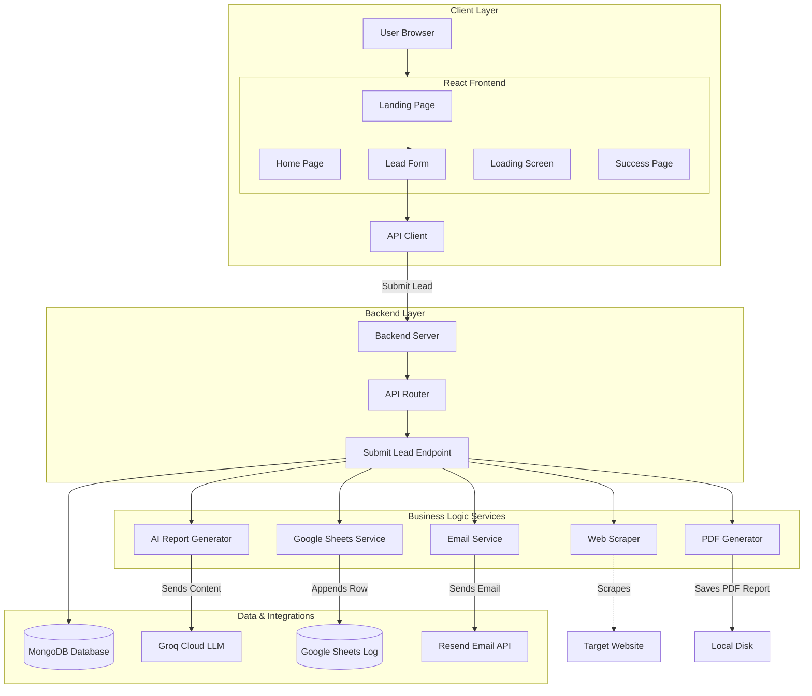
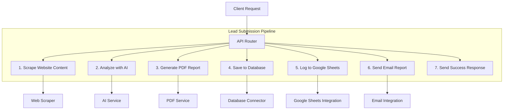
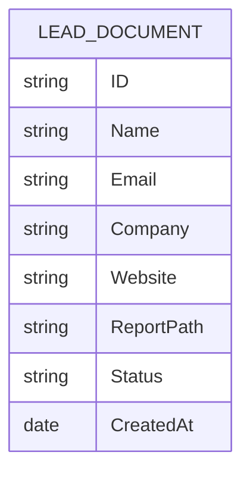
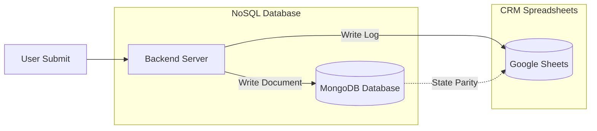
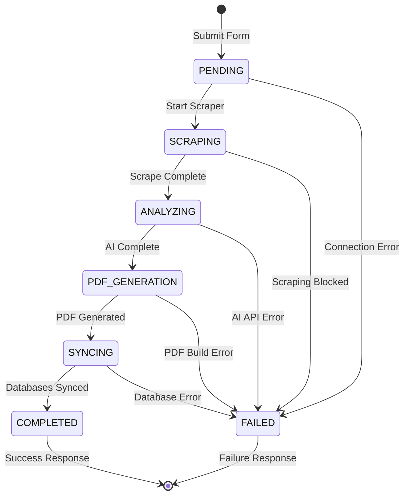
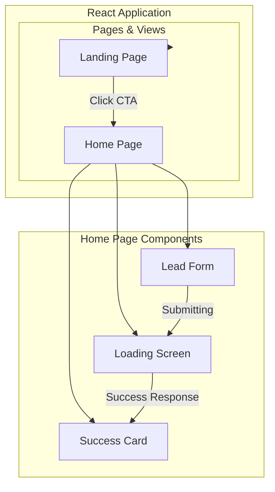

## 1st: Full System Architecture

---

## 2nd: Backend Architecture

---

## 3rd: Database Architecture & State Flow

### A. Database Document Schema

### B. Dual-Sync Architecture

### C. State Machine Flow

---

## 4th: Frontend Architecture

